# leegle-gpt-image-downloader 中文图文安装教程

本教程适合第一次安装 Chrome 插件的新手用户。  
按照下面步骤操作，就可以在 Chrome 浏览器中安装并使用 `leegle-gpt-image-downloader` 批量下载 ChatGPT 生成图片。

---

## 01 下载插件安装包

打开 GitHub 项目页面，点击右侧或页面上方的 **Releases**。

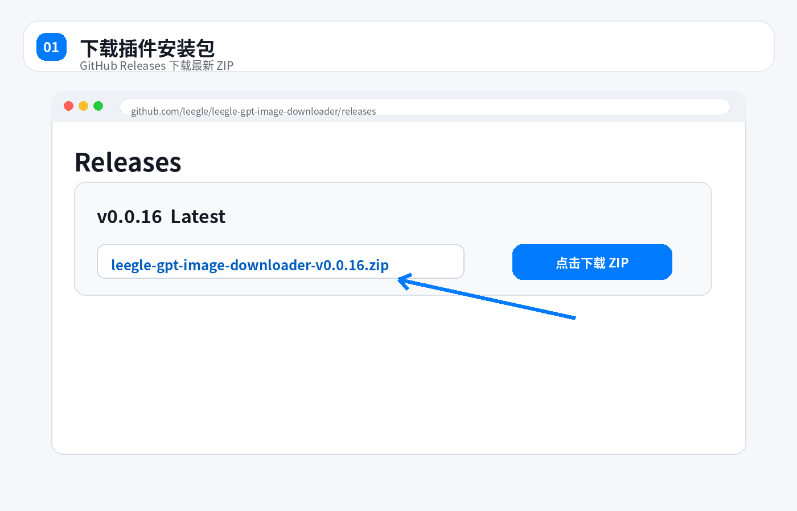

找到最新版本，例如：

```text
v0.0.18
```

下载文件：

```text
leegle-gpt-image-downloader-v0.0.18.zip
```

---

## 02 解压 ZIP 文件

下载完成后，右键 ZIP 文件，选择：

```text
全部解压 / Extract All
```

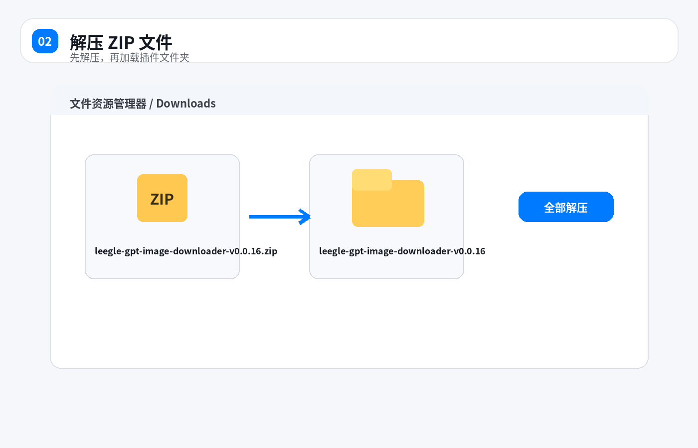

解压后会得到一个文件夹，例如：

```text
leegle-gpt-image-downloader-v0.0.18
```

注意：Chrome 插件不能直接加载 ZIP 文件，必须先解压。

---

## 03 打开 Chrome 扩展程序页面

打开 Chrome 浏览器，在地址栏输入：

```text
chrome://extensions/
```

然后按回车。

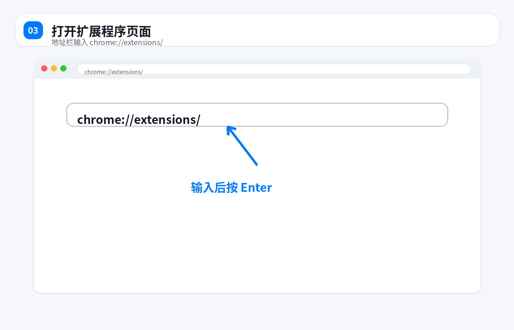

---

## 04 打开开发者模式

进入扩展程序页面后，在右上角找到：

```text
开发者模式 / Developer mode
```

把它打开。

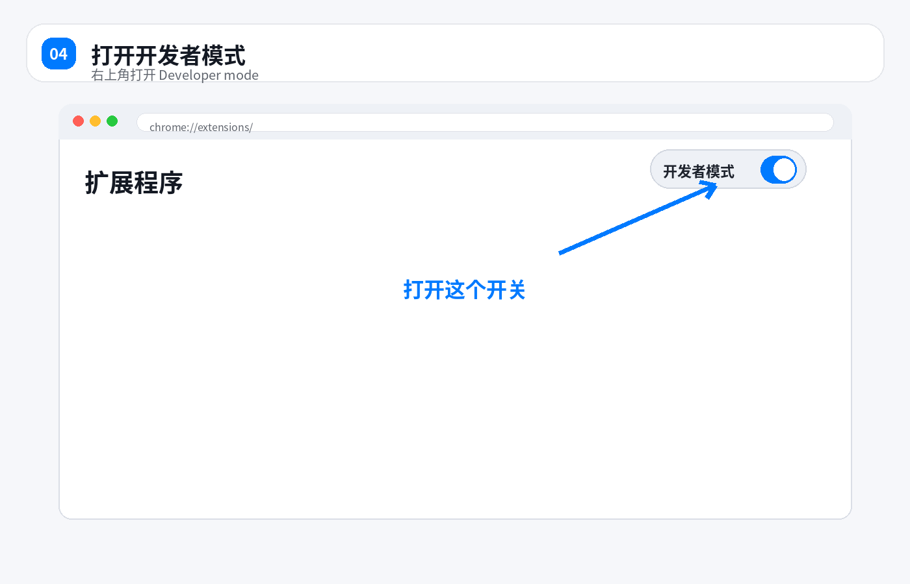

---

## 05 加载已解压的插件

点击：

```text
加载已解压的扩展程序 / Load unpacked
```

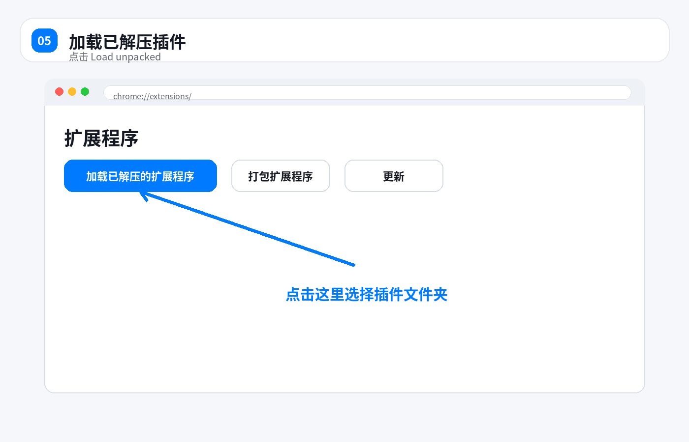

然后选择刚才解压出来的插件文件夹：

```text
leegle-gpt-image-downloader-v0.0.18
```

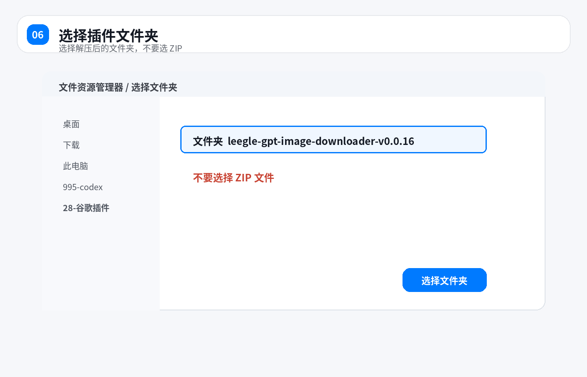

注意：请选择文件夹，不要选择 ZIP 文件。

---

## 06 确认插件安装成功

如果安装成功，Chrome 扩展程序页面会出现：

```text
leegle-gpt-image-downloader
```

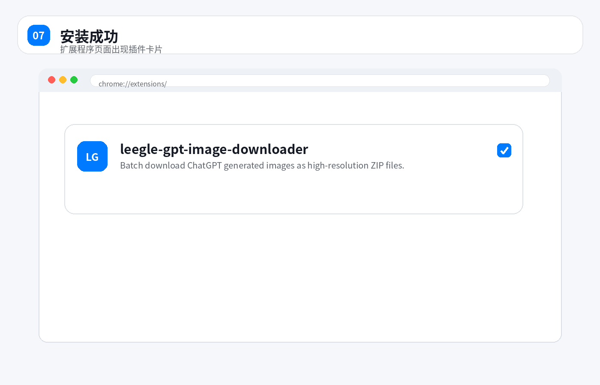

---

## 07 固定插件图标

为了方便使用，建议把插件固定到浏览器右上角。

操作方法：

1. 点击 Chrome 右上角的拼图图标。
2. 找到 `leegle-gpt-image-downloader`。
3. 点击旁边的图钉按钮。

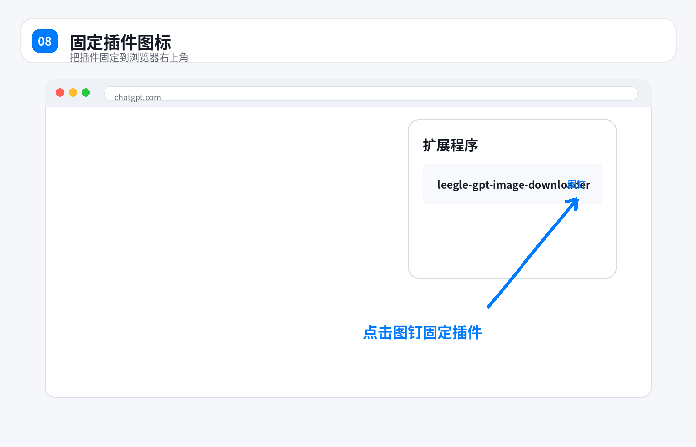

---

## 08 打开 ChatGPT 图片会话

打开 ChatGPT，进入包含生成图片的会话。

找到你想下载的那一组图片，把图片组滚动到屏幕中间。

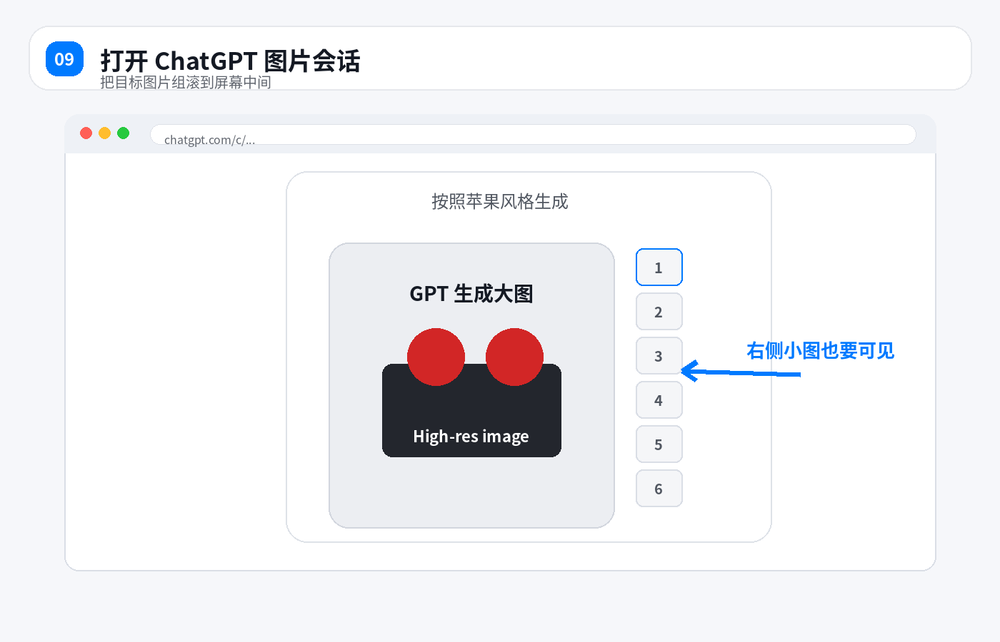

建议确保：

- 左侧大图可以看到
- 右侧小图列表可以看到
- 图片已经加载完成
- 不要停留在空白加载状态

---

## 09 中英文切换

插件窗口右上角有 `EN / 中文` 按钮。

- 当前是中文界面时，点击 `EN` 可切换到英文界面。
- 当前是英文界面时，点击 `中文` 可切换回中文界面。
- 语言设置会保存在本地浏览器中，下次打开会继续使用上次选择的语言。

---

## 10 点击插件自动采集图片

点击浏览器右上角的插件图标。

插件会自动打开窗口，并自动采集当前屏幕可见的高清图片组。

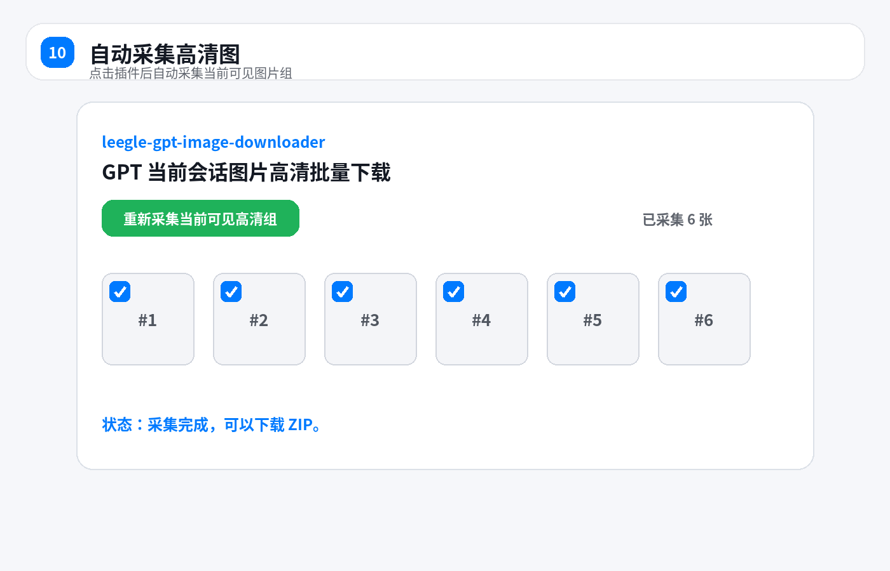

采集完成后，插件会显示已经采集到的图片数量，例如：

```text
已采集 6 张
```

---

## 11 下载高清 ZIP 文件

点击：

```text
直接下载已采集高清 ZIP
```

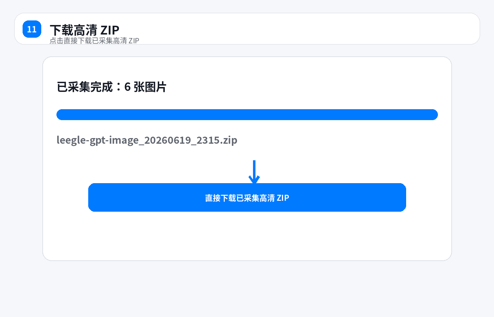

插件会自动把图片打包成 ZIP 文件。

文件名示例：

```text
leegle-gpt-image_20260619_2315.zip
```

---

## 12 解压后查看图片

下载完成后，右键 ZIP 文件，选择解压。

单组图片结构示例：

```text
leegle-gpt-image_20260619_2315/
  image_01.png
  image_02.png
  image_03.png
  image_04.png
  image_05.png
  image_06.png
```

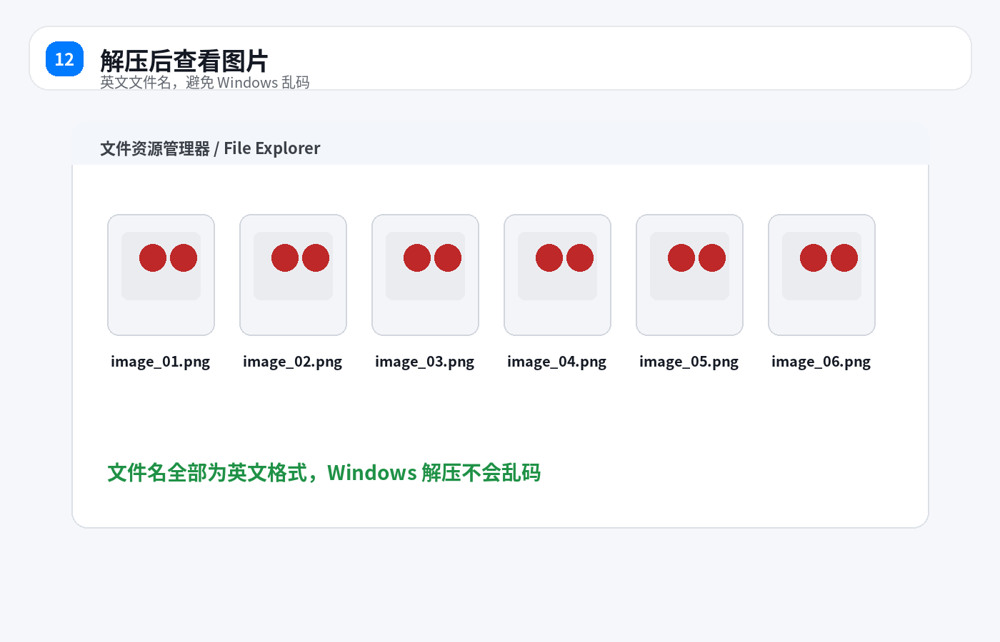

插件使用英文文件名，避免 Windows 解压后出现中文乱码。

---

# 常见问题

## 1. 为什么提示无法加载扩展程序？

请确认你选择的是解压后的插件文件夹，而不是 ZIP 文件。

正确：

```text
leegle-gpt-image-downloader-v0.0.18
```

错误：

```text
leegle-gpt-image-downloader-v0.0.18.zip
```

## 2. 为什么没有识别到图片？

请检查：

1. 当前页面是否是 ChatGPT 会话页面。
2. 页面中是否有 GPT 生成的图片。
3. 图片组是否已经滚动到屏幕中间。
4. 图片是否已经加载完成。

如果还是没有识别，可以点击插件里的：

```text
重新采集当前可见高清组
```

## 3. 为什么只下载了一张图片？

如果页面只显示一张大图，没有显示右侧小图列表，插件可能只能识别当前大图。

建议把完整图片组滚动到屏幕中间，确保左侧大图和右侧小图都能看到，然后重新采集。

## 4. 为什么文件名不是中文？

为了避免 Windows 解压乱码，插件默认使用英文文件名：

```text
leegle-gpt-image_YYYYMMDD_HHMM.zip
```

这是正常设计。

## 5. 如何更新插件？

当 GitHub 发布新版本时，例如：

```text
v0.0.19
```

更新方法：

1. 下载最新 ZIP。
2. 解压 ZIP。
3. 打开 `chrome://extensions/`。
4. 删除旧版本插件，或者关闭旧版本。
5. 点击“加载已解压的扩展程序”。
6. 选择最新版本插件文件夹。

---

# 隐私说明

本插件只在本地浏览器中运行。

插件不会上传图片，不会保存聊天内容，也不会连接第三方服务器。  
图片采集、高清预览和 ZIP 打包都在你的浏览器本地完成。
